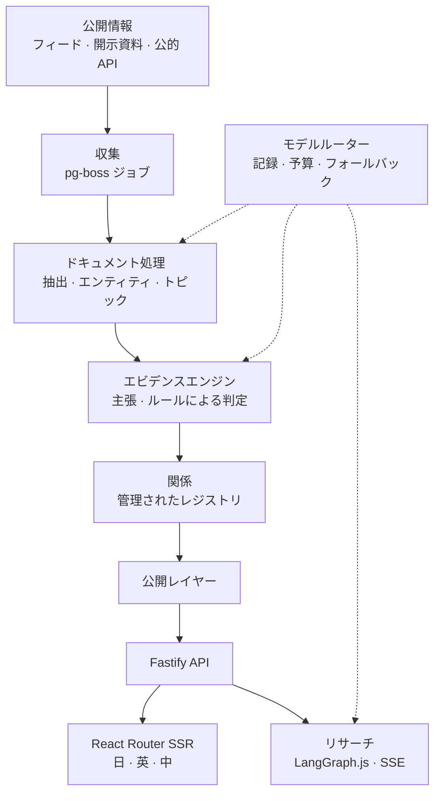

# AiSeek

**あらゆる分野で、何が変わったのかを。** · [aiseek.dev](https://aiseek.dev/ja) · [English](README.md) · [中文](README.zh-CN.md)

AiSeek は、テクノロジー、経済、市場、政策、エネルギー、地政学など 24 の分野の公開情報を読み、「何が変わったのか」を確かめられる構造に
まとめます。誰に影響するのか、どうつながっているのか、そしてすべてのつながりの根拠は何か。日本語・英語・中国語で公開しています。

> このリポジトリは紹介用です。プロダクトのソースは非公開で、[`excerpts/`](excerpts/) のコードはそこから手を加えずに抜粋したものです。

## できること

- **シグナル**：一つひとつの変化がシグナルになり、出典、根拠の数、そして「なぜ重要か」が添えられます。
- **構造**：企業・トピック・シグナルを中心に、エンティティと関係を構造図として描きます。実線は事実、破線は根拠のある推論、点線は仮説で、
  三つが混ざることはありません。
- **根拠が先**：すべての関係は一つの主張を指し、すべての事実はその出典の一節までたどれます。
- **リサーチ**：ログインしたユーザーは、シグナルや企業について多段階のリサーチを実行し、その過程をリアルタイムで見られます。
- **ブリーフ・予定・マーケット**：毎日のブリーフ、公的統計の公表予定、為替とマクロのデータ。

## 画面

**企業の構造。** 供給元、顧客、競合と提携先、出資関係、そして制約。

**ホームのフィード。** 主要な変化、新着のライブワイヤー、その日の分野ごとの流れ。

**シグナル。** 何が起きたのか、なぜ重要なのか、その裏にあるすべての出典。

**マーケット。** 為替の 30 日と 3 か月の推移、当日の騰落、クロスレート表。

**中国語でも。** 日本語・英語・中国語に対応しています。翻訳は事前に用意し、ページの表示中に生成することはありません。

**スマートフォンでは、** デスクトップを縮めるのではなく、専用の下部ナビとレイアウトで表示します。

## 仕組み

**データベースは一つ。** PostgreSQL 17 が正となるストアで、ベクトル（pgvector）、グラフ投影（Apache AGE、リレーショナルテーブルから
再構築可能）、ジョブキュー（pg-boss）、リサーチのチェックポイントもすべて担います。Redis も Kafka も、別のベクトルデータベースもありません。

**事実はモデルではなくルールで決まる。** 条件を満たす出典が正確な位置とともに直接述べ、それを上回る反証がない場合にのみ FACT になります。
SUPPORTED には独立した二つの根拠グループと書かれた推論理由が必要で、それ以外はすべて HYPOTHESIS のままです。モデルの確信度は判定に
使いません。[`excerpts/promote.ts`](excerpts/promote.ts) を参照。

**関係の語彙は閉じている。** 47 種類の関係タイプがあり、それぞれに許されるエンティティの種類、逆関係、減衰期間、時間範囲のルールが
決まっています。モデルは関係を提案できますが、新しい種類を作ることはできません。
[`excerpts/relation-registry.ts`](excerpts/relation-registry.ts) を参照。

**モデル呼び出しはすべて記録される。** LLM と埋め込みの呼び出しはすべて一つのルーターを通り、送信前に予算を確認し、記録を残し、
不調なプロバイダーは遮断して、設定された経路でフォールバックします。ページの表示がモデルを待つことはありません。

**小さなマシンに、上限のある待ち行列。** 埋め込みのフォールバック先は 2 コアのサーバーで動く自前の bge-m3 です。受付ゲートが待ち行列と
待ち時間に上限を設け、混んでいるときは誰も読まない結果を計算する代わりに「busy」と返します。[`excerpts/gate.py`](excerpts/gate.py) を参照。

**レイヤー構造はテストで守る。** `contracts → database → engines → research / watch / publication → apps`。パッケージがレイヤーをまたいで
参照したり、フロントエンドがデータベース・キュー・モデルルーターを参照したり、ルーター以外がモデルのベンダーと通信したりすると、ビルドが失敗します。

## 技術スタック

| レイヤー | |
|---|---|
| フロントエンド | React 19、React Router 8（SSR）、Tailwind CSS 4、Motion、Vite 7 · リクエストごとの CSP nonce、hreflang、JSON-LD |
| API とジョブ | Node 24、TypeScript 5.9、Fastify 5、zod 4、pg-boss、LangGraph.js、Better Auth（二要素認証）、Polar 決済 |
| ドキュメント処理 | Python 3.12、FastAPI、Crawl4AI、Docling、trafilatura、GLiNER、jieba3 / Janome、MiniCheck、Splink、BERTopic、EdgarTools |
| データ | PostgreSQL 17、pgvector、Apache AGE、非公開リサーチには行レベルセキュリティ |
| 運用 | VPS 上の Docker Compose、Caddy、自前の CI、毎晩のバックアップと毎月の復元テスト、前進のみでチェックサム付きのマイグレーション |

## 規模

TypeScript 約 9 万行、Python 2,700 行、SQL マイグレーション 50 本。4 つのアプリ、25 のパッケージ、2 つのサービスで、テストファイルは 161。
2026 年 10 月 6 日時点で、公開サイトにはシグナル 740、エンティティ 13,337、関係 5,654、根拠 64,473 件があります。

## 作り方

2026 年 10 月 2 日（金）に着手。一人で設計・開発し、AI コーディングエージェント（Claude Code と Codex）と協働しました。エージェントは
「根拠が先、事実は後」「表示経路でモデルを呼ばない」「有料の呼び出しにはすべて記録」「マイグレーションは前進のみ」という明文化された
ルールに従い、特に重要なルールは信頼ではなくテストで守られています。

## 連絡先とスポンサー

AiSeek はすべて自己資金で運営しています。スポンサー、出資、協業、お仕事のご相談など、お気軽にご連絡ください。

| | |
|---|---|
| メール | [wyc610721@gmail.com](mailto:wyc610721@gmail.com) · [support@aiseek.dev](mailto:support@aiseek.dev) |
| LinkedIn | [WU Yuanchao](https://www.linkedin.com/in/%E3%82%A8%E3%83%B3%E3%83%81%E3%83%A7%E3%82%A6-%E3%82%B4-6ab2a2413/) |
| X | [@Ai__Seek](https://x.com/Ai__Seek) |
| Telegram | [@aiseek_dev](https://t.me/aiseek_dev) |
| Instagram | [@wwwwww_zzyc](https://www.instagram.com/wwwwww_zzyc/) |
| WeChat | YOLOWY2（[QR コード](https://aiseek.dev/ja/contact#wechat)） |
| GitHub | [YOLOW92](https://github.com/YOLOW92) |

---

スクリーンショットとコードの抜粋 © 2026 YOLOW92。無断転載を禁じます。サードパーティのコンポーネントはそれぞれのライセンスに従い、
プロダクトの [aiseek.dev/ja/credits](https://aiseek.dev/ja/credits) に記載しています。
