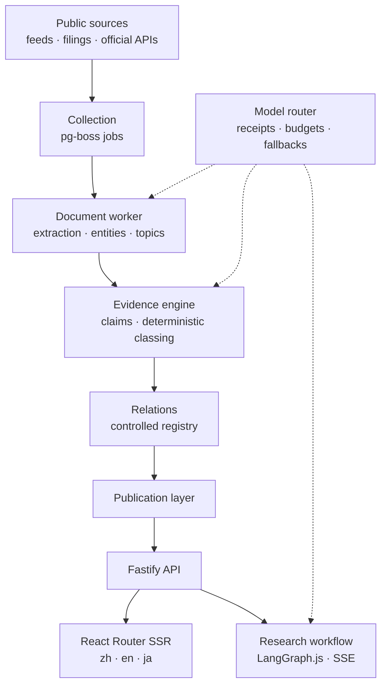

# AiSeek

**See what changed, in every domain.** · [aiseek.dev](https://aiseek.dev) · [中文](README.zh-CN.md) · [日本語](README.ja.md)

AiSeek reads public sources across 24 domains — technology, economy, markets, policy, energy, geopolitics and more — and turns
what changed into a structure you can check: who it touches, how they are connected, and the evidence behind every link.
It is live in Chinese, English and Japanese.

> This repository is a showcase. The product source is private; the excerpts in [`excerpts/`](excerpts/) are taken from it unchanged.

## What it does

- **Signals.** Each change is a signal with its sources, evidence count and a short "why it matters".
- **Structure.** Entities and relations around a company, topic or signal, drawn as a map. Solid lines are facts, dashed lines are
  supported inferences, dotted lines are hypotheses, and the three are never mixed.
- **Evidence first.** Every relation points to a claim, and every fact points to the passage it came from.
- **Research.** Signed-in users can run a multi-step research workflow on a signal or company and watch it stream in.
- **Brief, Ahead, Markets.** A daily brief, a calendar of official statistics releases, and FX and macro data.

## A look around

**Structure of a company.** Who supplies it, who it serves, who it competes and partners with, who owns it and what constrains it.

**The home feed.** Lead changes, a live wire of everything new, and the day's threads across domains.

**A signal.** What happened, why it matters, and every source behind it.

**Markets.** FX with 30-day and three-month views, daily movers and a full cross-rate table.

**In Chinese,** with English and Japanese alongside. Translations are prepared ahead of time, never generated while a page renders.

**On a phone,** with its own bottom bar and layouts rather than a squeezed desktop page.

## How it is built

**One database.** PostgreSQL 17 is the canonical store and also carries the vectors (pgvector), the graph projection
(Apache AGE, rebuildable from the relational tables), the job queue (pg-boss) and the research workflow checkpoints. There is no
Redis, Kafka or separate vector database.

**Facts are decided by rules, not by a model.** A claim becomes FACT only when a qualifying source states it directly with an exact
locator and nothing outweighs it; SUPPORTED needs two independent evidence groups and a written rationale; everything else stays a
HYPOTHESIS. Model confidence is never an input. See [`excerpts/promote.ts`](excerpts/promote.ts).

**A closed vocabulary of relations.** 47 relation types, each with allowed entity types, inverse, decay and temporal rules. A model
can propose a relation but cannot invent a new kind. See [`excerpts/relation-registry.ts`](excerpts/relation-registry.ts).

**Every model call is accounted for.** All LLM and embedding calls go through one router that checks the budget before dispatch,
writes a receipt, opens a circuit breaker on failing providers and falls back along a configured route. No page render ever waits
on a model.

**Small machines, bounded queues.** Embeddings fall back to a self-hosted bge-m3 on a two-core server. Its admission gate keeps the
wait bounded and answers "busy" instead of computing answers nobody will read. See [`excerpts/gate.py`](excerpts/gate.py).

**Layering is tested.** `contracts → database → engines → research / watch / publication → apps`. An architecture test fails the
build if a package imports across layers, if the web app imports the database, queue or model router, or if anything but the
router talks to a model vendor.

## Stack

| Layer | |
|---|---|
| Web | React 19, React Router 8 (SSR), Tailwind CSS 4, Motion, Vite 7 · per-request CSP nonce, hreflang, JSON-LD |
| API and jobs | Node 24, TypeScript 5.9, Fastify 5, zod 4, pg-boss, LangGraph.js, Better Auth (2FA), Polar billing |
| Documents | Python 3.12, FastAPI, Crawl4AI, Docling, trafilatura, GLiNER, jieba3 / Janome, MiniCheck, Splink, BERTopic, EdgarTools |
| Data | PostgreSQL 17, pgvector, Apache AGE, row-level security for private research |
| Operations | Docker Compose on a VPS, Caddy, self-hosted CI, nightly backups with a monthly restore test, forward-only checksummed migrations |

## By the numbers

About 90,000 lines of TypeScript, 2,700 of Python and 50 SQL migrations, in 4 apps, 25 packages and 2 services, with 161 test
files. On 6 October 2026 the live site held 740 signals, 13,337 entities, 5,654 relations and 64,473 pieces of evidence.

## How it was made

Started on Friday, 2 October 2026. Designed and built by one person, working with AI coding agents (Claude Code and Codex). The agents worked under a written rulebook —
evidence before facts, no model calls on render paths, receipts for every paid call, forward-only migrations — and the rules that
matter most are enforced by tests rather than by trust.

## Contact and sponsorship

AiSeek is self-funded. If you would like to sponsor it, invest, collaborate, or work with me, I would be glad to hear from you.

| | |
|---|---|
| Email | [wyc610721@gmail.com](mailto:wyc610721@gmail.com) · [support@aiseek.dev](mailto:support@aiseek.dev) |
| LinkedIn | [WU Yuanchao](https://www.linkedin.com/in/%E3%82%A8%E3%83%B3%E3%83%81%E3%83%A7%E3%82%A6-%E3%82%B4-6ab2a2413/) |
| X | [@Ai__Seek](https://x.com/Ai__Seek) |
| Telegram | [@aiseek_dev](https://t.me/aiseek_dev) |
| Instagram | [@wwwwww_zzyc](https://www.instagram.com/wwwwww_zzyc/) |
| WeChat | YOLOWY2 ([QR code](https://aiseek.dev/en/contact#wechat)) |
| GitHub | [YOLOW92](https://github.com/YOLOW92) |

---

Screenshots and excerpts © 2026 YOLOW92. All rights reserved. Third-party components keep their own licences; the product credits
them at [aiseek.dev/en/credits](https://aiseek.dev/en/credits).
