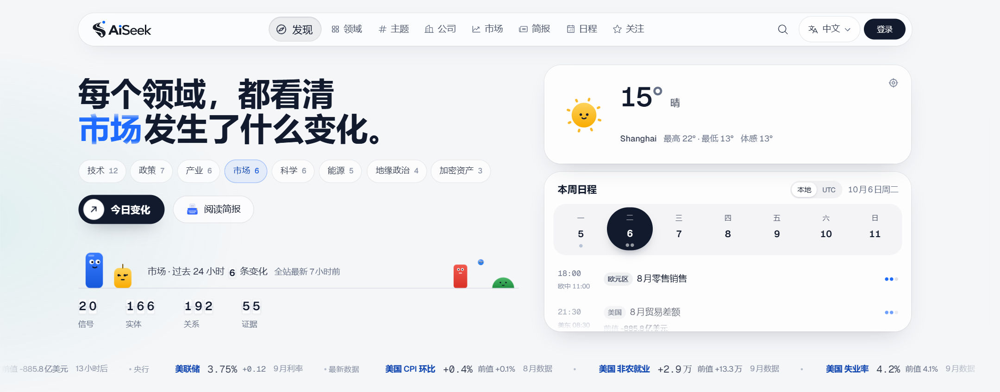
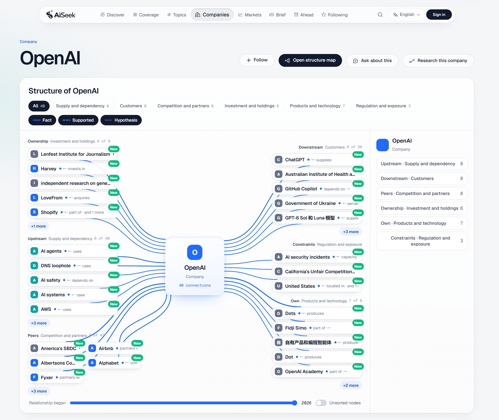
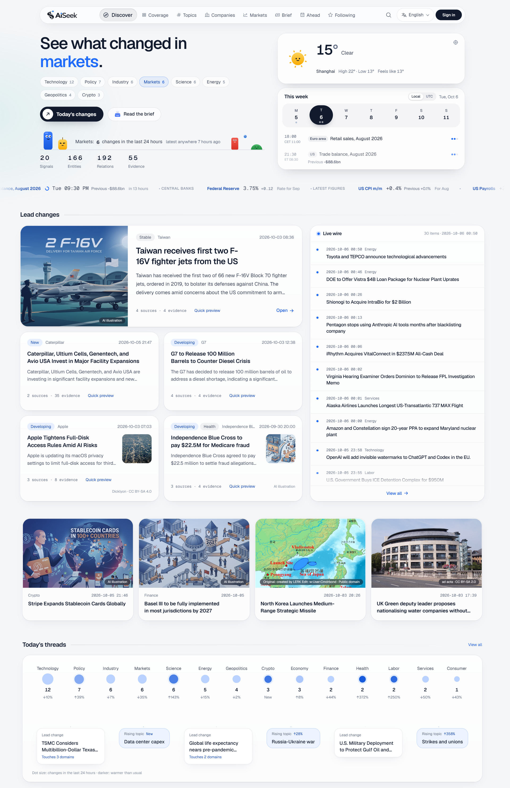
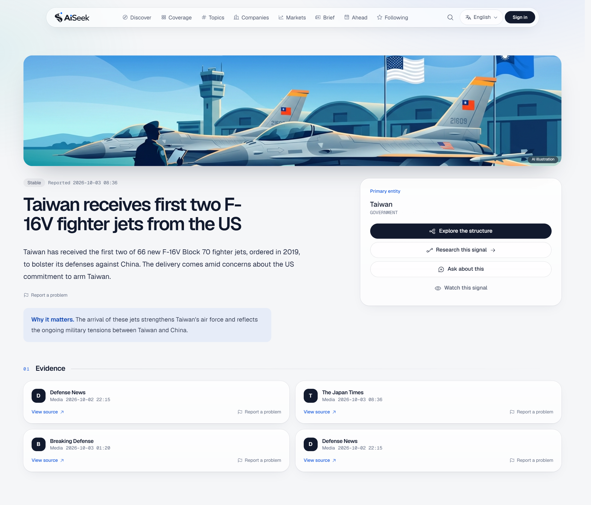
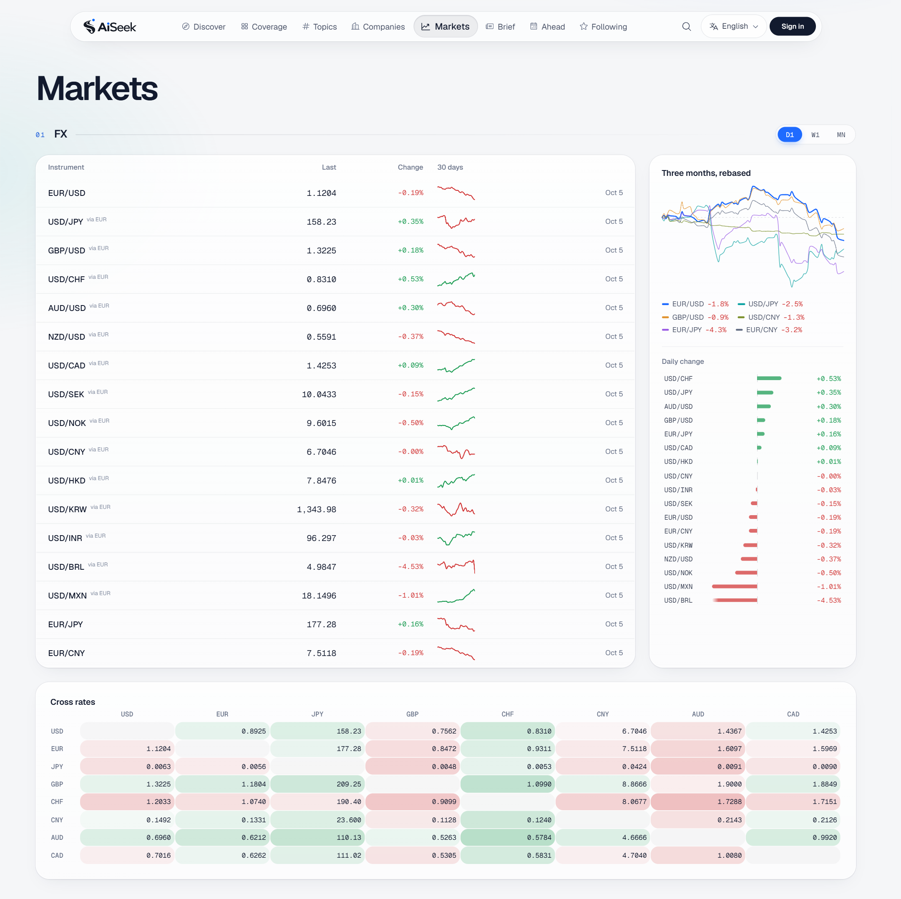
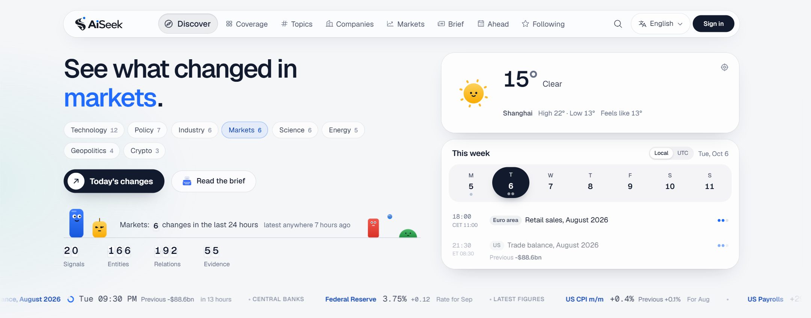
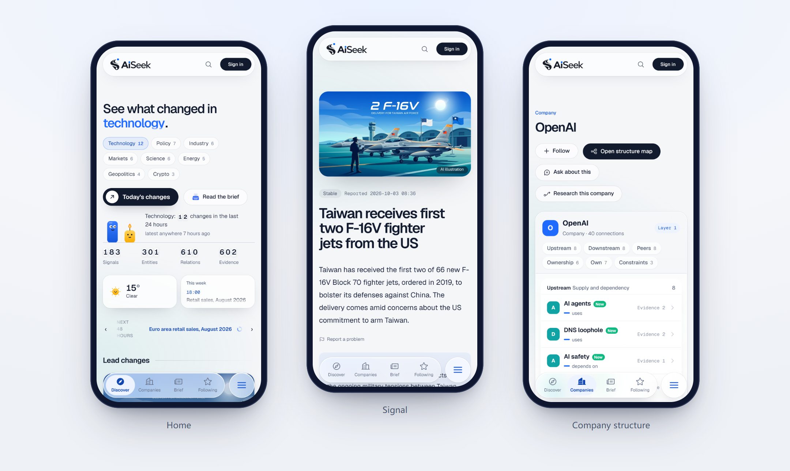
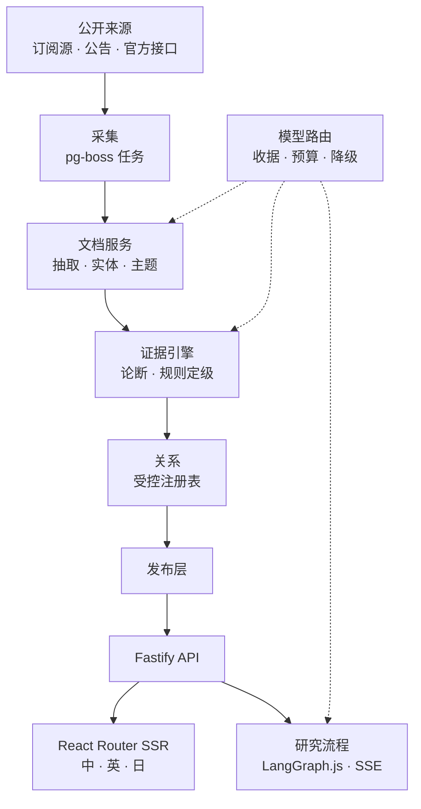

# AiSeek

**每个领域，都看清发生了什么变化。** · [aiseek.dev](https://aiseek.dev/zh) · [English](README.md)

AiSeek 持续读取 24 个领域的公开来源，覆盖技术、经济、市场、政策、能源、地缘政治等，把“发生了什么变化”整理成可以核对的结构：
影响到谁，彼此怎么关联，每一条关联背后的证据是什么。线上提供中文、英文、日文三种语言。

> 本仓库只用于展示。产品源码不公开，[`excerpts/`](excerpts/) 中的代码原样摘自产品仓库。

## 产品能做什么

- **信号**：每一条变化都是一个信号，附带来源、证据数量和一句“为什么重要”。
- **结构**：围绕公司、主题或信号，把实体和关系画成结构图。实线是事实，虚线是有依据的推断，点线是假设，三者从不混用。
- **证据优先**：每条关系都指向一个论断，每个事实都能追溯到原文段落。
- **研究**：登录用户可以针对一个信号或一家公司发起多步研究，过程实时流式展示。
- **简报、日程、市场**：每日简报、官方统计数据发布日程、外汇和宏观数据。

## 看看界面

**公司结构。** 谁是它的供应方、它服务谁、和谁竞争或合作、谁持有它、受什么约束。

**首页信息流。** 头条变化、实时快讯，以及当天各领域的主线。

**信号详情。** 发生了什么、为什么重要、背后的每一个来源。

**市场。** 外汇的 30 天和三个月走势、当日涨跌排行、完整的交叉汇率表。

**英文界面。** 同时提供中文、英文、日文。翻译都是提前准备好的，页面渲染时从不临时生成。

**手机端。** 有自己的底部导航和布局，而不是把桌面页面硬塞进小屏。

## 技术设计

**一个数据库。** PostgreSQL 17 是唯一的权威存储，同时承载向量（pgvector）、图投影（Apache AGE，可由关系表重建）、
任务队列（pg-boss）和研究流程的检查点。没有 Redis、Kafka，也没有单独的向量数据库。

**事实由规则判定，不由模型判定。** 只有当合格来源直接陈述、带精确定位、且没有更强的反证时，论断才是 FACT；SUPPORTED 需要两组独立证据
加书面推理依据；其余一律是 HYPOTHESIS。模型给出的置信度从不参与判定。见 [`excerpts/promote.ts`](excerpts/promote.ts)。

**关系词表是封闭的。** 共 47 种关系类型，每种都规定了允许的实体类型、反向关系、衰减期和时间范围要求。模型可以提议关系，但不能发明新的关系种类。
见 [`excerpts/relation-registry.ts`](excerpts/relation-registry.ts)。

**每一次模型调用都记账。** 所有大模型和向量调用都经过同一个路由：发送前检查预算，发送后写收据，故障的服务商会被熔断，并按配置的路线降级。
页面渲染从不等待模型。

**小机器，有界队列。** 向量服务的后备是一台两核服务器上自建的 bge-m3。准入闸门限制排队长度和等待时间，忙时直接回复“忙”，
而不是去计算一个已经没人等的结果。见 [`excerpts/gate.py`](excerpts/gate.py)。

**分层由测试保证。** `contracts → database → engines → research / watch / publication → apps`。如果某个包跨层引用，
或者前端引用了数据库、队列、模型路由，或者路由之外的代码直接访问模型服务商，构建就会失败。

## 技术栈

| 层 | |
|---|---|
| 前端 | React 19、React Router 8（SSR）、Tailwind CSS 4、Motion、Vite 7 · 每请求 CSP nonce、hreflang、JSON-LD |
| API 与任务 | Node 24、TypeScript 5.9、Fastify 5、zod 4、pg-boss、LangGraph.js、Better Auth（双重验证）、Polar 计费 |
| 文档处理 | Python 3.12、FastAPI、Crawl4AI、Docling、trafilatura、GLiNER、jieba3 / Janome、MiniCheck、Splink、BERTopic、EdgarTools |
| 数据 | PostgreSQL 17、pgvector、Apache AGE，私有研究使用行级安全 |
| 运维 | VPS 上的 Docker Compose、Caddy、自建 CI、每晚备份加每月恢复演练、只进不退且带校验和的数据库迁移 |

## 规模

约 9 万行 TypeScript、2,700 行 Python、50 个 SQL 迁移，分为 4 个应用、25 个包、2 个服务，共 161 个测试文件。
2026 年 10 月 6 日，线上共有 740 个信号、13,337 个实体、5,654 条关系、64,473 条证据。

## 开发方式

由一个人设计和开发，使用 AI 编程代理（Claude Code 和 Codex）协作完成。代理遵守一份成文的工程规则：先有证据再有事实、渲染路径不调用模型、
每次付费调用都有收据、迁移只进不退。最关键的几条规则由测试强制执行，而不是靠自觉。

---

截图和代码节选 © 2026 YOLOW92，保留所有权利。第三方组件遵循各自的许可证，产品在
[aiseek.dev/zh/credits](https://aiseek.dev/zh/credits) 中列明。
